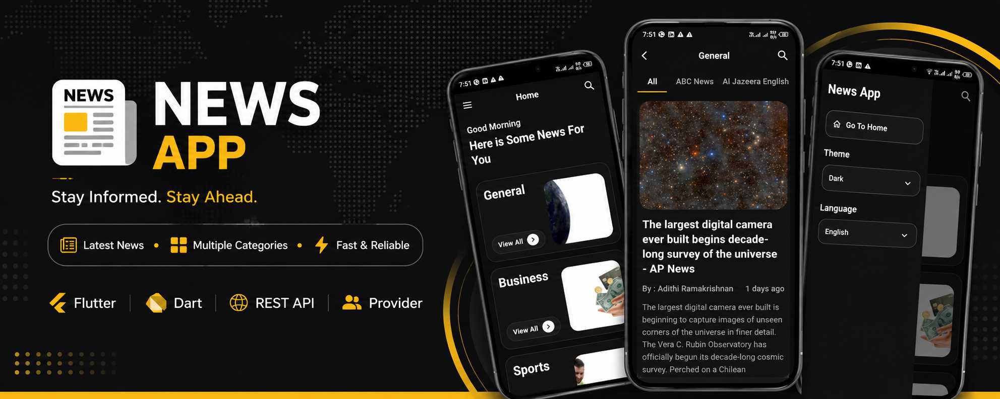

# 📰 News Route

A modern Flutter News application that allows users to browse the latest news across multiple categories using REST APIs with a clean and responsive UI.
A new Flutter project.

## 📖 Overview

News Route is a Flutter application that provides users with the latest news from different categories in a simple and intuitive interface.

The application retrieves live news data through REST APIs and focuses on clean architecture, reusable components, and responsive UI design.
## 📱 Screenshots

## Getting Started

This project is a starting point for a Flutter application.

A few resources to get you started if this is your first Flutter project:

- [Learn Flutter](https://docs.flutter.dev/get-started/learn-flutter)
- [Write your first Flutter app](https://docs.flutter.dev/get-started/codelab)
- [Flutter learning resources](https://docs.flutter.dev/reference/learning-resources)

For help getting started with Flutter development, view the
[online documentation](https://docs.flutter.dev/), which offers tutorials,
samples, guidance on mobile development, and a full API reference.
