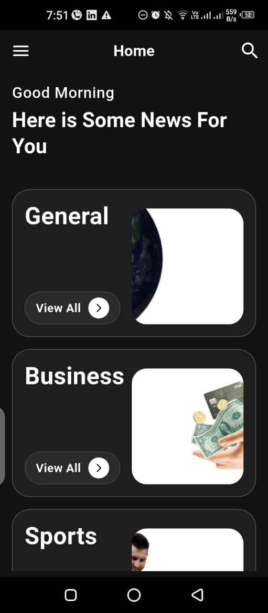
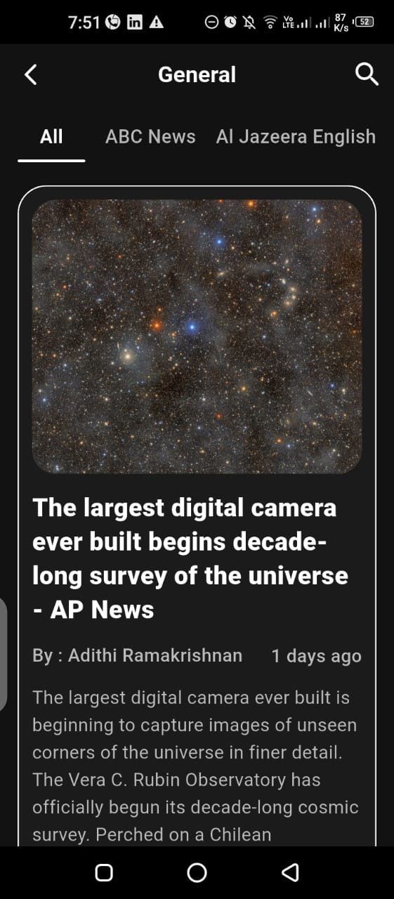
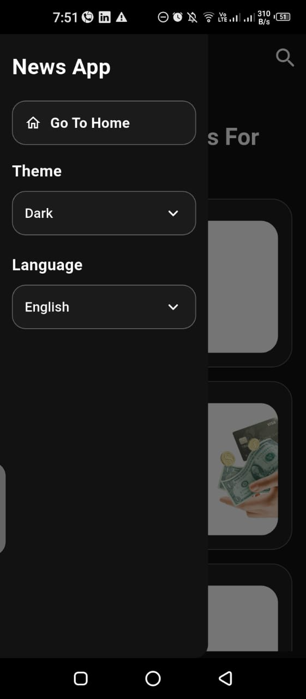

# 📰 News Route

A modern Flutter News application that allows users to browse the latest news across multiple categories using REST APIs with a clean and responsive UI.
A new Flutter project.

# 📖 Overview

News Route is a modern Flutter application that delivers live news from multiple trusted sources through REST APIs.

The application provides a clean and responsive user interface while following reusable widget design and scalable architecture principles.

It allows users to browse different news categories, search articles, and read detailed news content with a smooth user experience.
## 📱 Screenshots

## 🎥 Demo Video

👉 Watch Demo

https://drive.google.com/file/d/1ha2ErYnYHIZkNsZw2yDNLaBnSab3laUR/view?usp=drive_link
---

# ✨ Features

- 📰 Browse news by multiple categories

- 🔍 Search for news articles

- 📖 Read detailed news

- 🌙 Dark Mode

- 🌍 Multi Sources

- 📡 REST API Integration

- ⚡ Fast Performance

- ♻️ Reusable Widgets

- 🎨 Clean UI Design

- 📱 Responsive Layout

---

# 🛠 Tech Stack

| Technology | Usage |
|------------|-------|
| Flutter | Cross-platform UI Development |
| Dart | Programming Language |
| REST API | Fetching Live News |
| HTTP | Network Requests |
| Provider | State Management |
| Material Design | UI Components |

---

# 🏗 Architecture

The application follows a clean and organized structure to improve scalability and maintainability.

text
lib
│
├── core
│
├── data
│   ├── models
│   ├── api
│   └── repositories
│
├── providers
│
├── screens
│
├── widgets
│
└── main.dart

### Architecture Highlights

- Separation of Concerns
- Reusable Widgets
- Provider State Management
- API Layer
- Model Classes
- Responsive UI

---

# 📂 Folder Structure

text
lib
├── core
├── models
├── providers
├── screens
├── widgets
├── api
├── utils
└── main.dart

# 📦 Packages Used

| Package | Purpose |
|---------|----------|
| provider | State Management |
| http | API Requests |
| cached_network_image | Image Caching |
| flutter_svg | SVG Support |
| intl | Date Formatting |

> Packages may vary depending on the project version.

# 🌐 API

This application uses **NewsAPI** to fetch live news articles.

### API Features

- Top Headlines
- Category News
- Search News
- Multiple Sources

API Documentation

🔗 https://newsapi.org/

---

# 🚀 Getting Started

Clone the repository

bash
git clone https://github.com/YourUsername/news_route.git

Go to project folder

bash
cd news_route

Install packages

bash
flutter pub get

Run the application

bash
flutter run

# 🔮 Future Improvements

- 🔖 Bookmark Articles
- 🌐 Multi-language Support
- 📱 iOS Optimization
- 🔔 Push Notifications
- ❤️ Favorite Articles
- 🌙 More Theme Customization
- 📤 Share News
- 🔍 Advanced Search Filters

---

# 👩‍💻 About the Developer

## Rahma Mahmoud

Flutter Developer passionate about creating clean, scalable, and user-friendly mobile applications.

Currently expanding my expertise in **Embedded Systems** while continuously improving my Flutter development skills.

### 📬 Connect with Me

- 💼 LinkedIn: https://www.linkedin.com/in/rahma-mahmmoud-43398a26b
- 💻 GitHub: https://github.com/engrahmamahmoud

